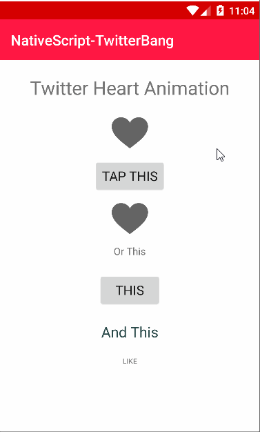

[](https://www.npmjs.com/package/nativescript-twitterbang)
[](https://www.npmjs.com/package/nativescript-twitterbang)

# NativeScript-TwitterBang :heartbeat:

NativeScript plugin for Android to use native Twitter animation for the exploding heart. 
This library uses [SmallBang by hanks-zyh](https://github.com/hanks-zyh/SmallBang) for the native animation.

### TwitterBang Usage 



## Installation
`npm install nativescript-twitterbang`

## Usage

### XML:
```XML
 <button text="This" tap="bangThis" margin="10" />
```


### TS:
```typescript
import { TwitterBang } from 'nativescript-twitterbang';

// args.object is the View/component that triggered the tap event
public bangThis(args) {
    // Execute the TwitterBang() method passing the view to execute the animation.
    TwitterBang(args.object);

    // If you want to change the image src after the twitter bang() for an <Image> it is easy...
    args.object.src = "~/images/fileName.png";
}
```


### JS:
```javascript
var TwitterBang = require("nativescript-twitterbang").TwitterBang;

// args.object is the View/component that triggered the tap event
function bangThis(args) {
    // Execute TwitterBang() method passing the view to execute the animation.
    TwitterBang(args.object);

    // If you want to change the image src after the twitter bang() for an <Image> it is easy...
    args.object.src = "~/images/fileName.png";
}
exports.bangThis = bangThis; 
```


